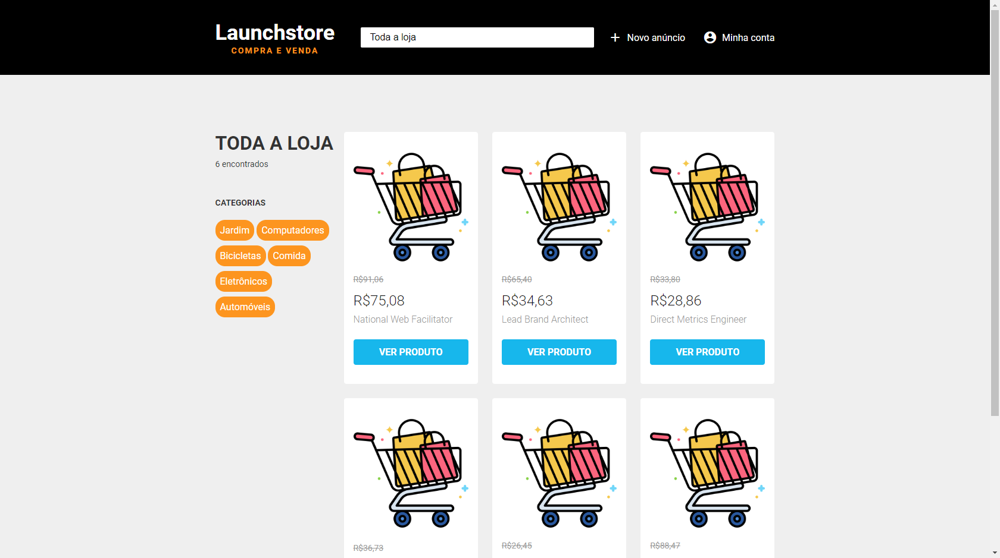
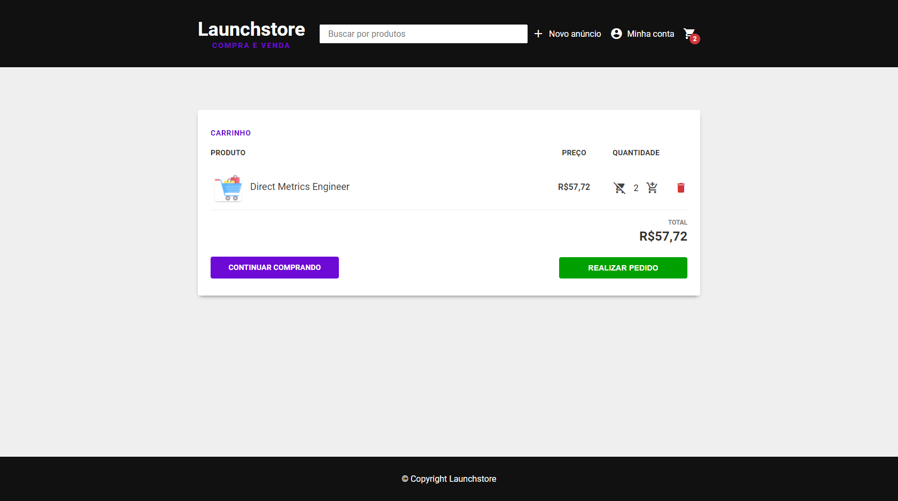
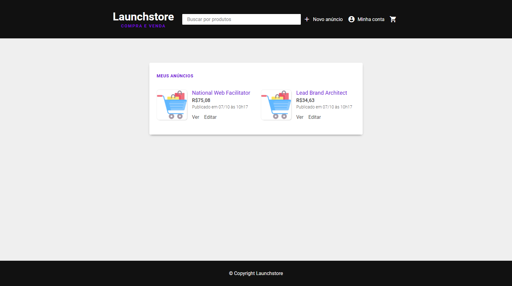
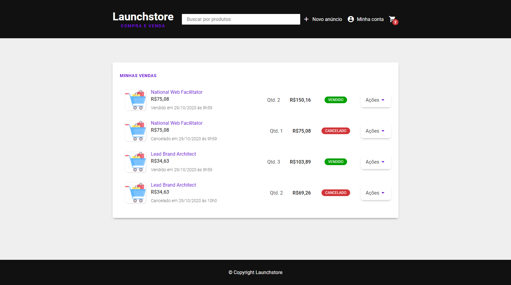
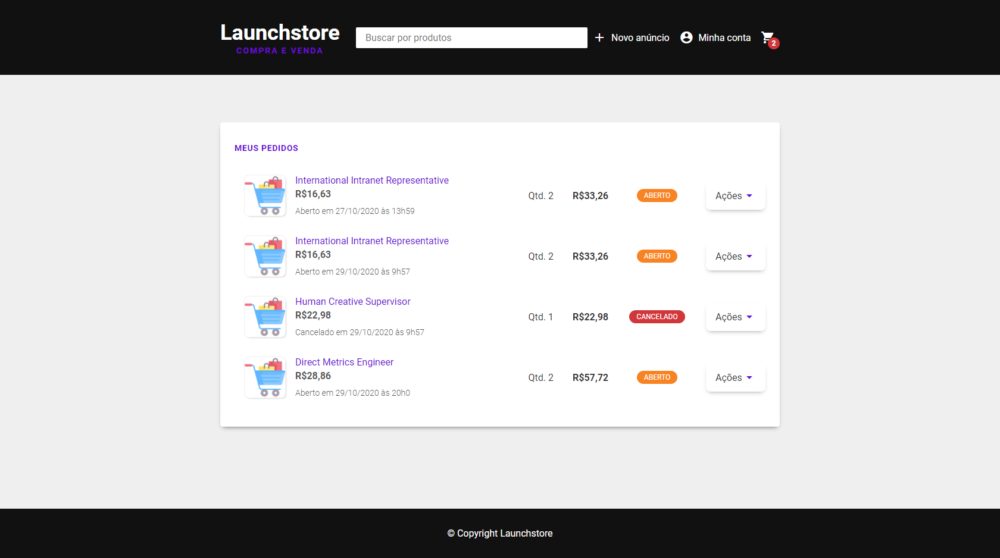
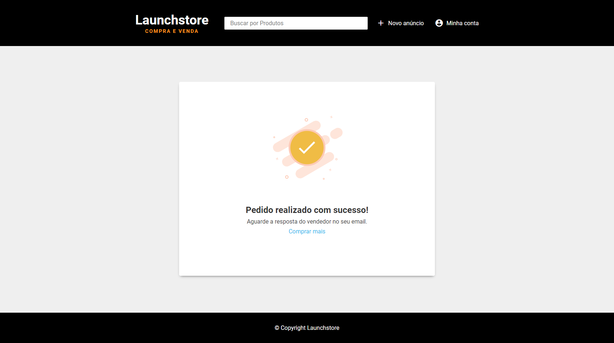
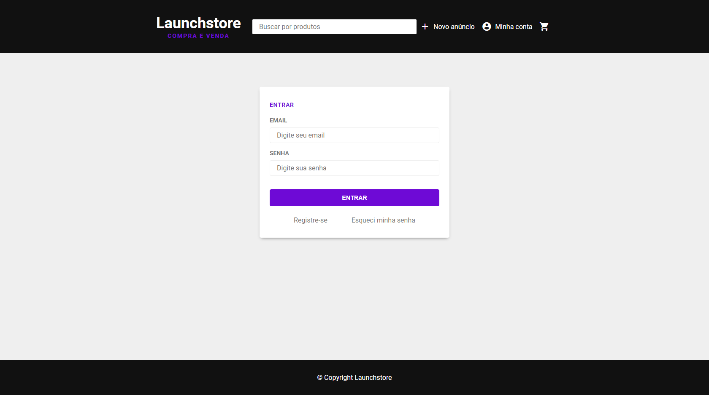
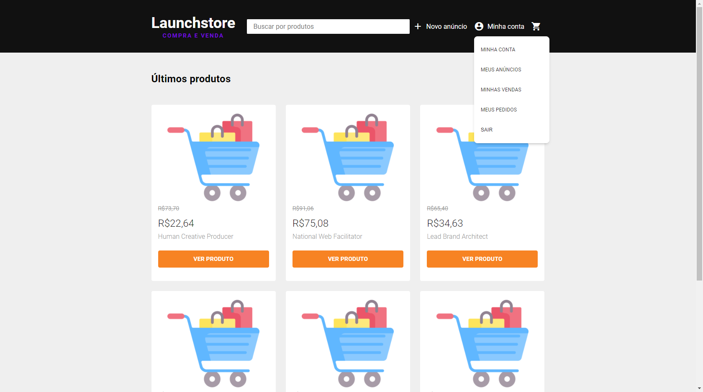

<h1 align ="center">
    
</h1>

> Launchstore is a simple application built with JavaScript and SQL queries 💰


## 📌 Resources 

- 💰 Buying and selling products.
- 📃 Search by categories.
- 🖼 Upload images.
- 🔑 Password recovery and session.
- 🎞 Post-order animations.
- 🛒 Cart and order management

## 🚀 Technologies used

The following technologies were used

- [x] [JavaScript](https://developer.mozilla.org/pt-BR/docs/Web/JavaScript)
- [x] [Node.js](https://nodejs.org/en/)
- [x] [PostgreSQL](https://www.postgresql.org/)

### 📜 **Libraries**

- [x] [browsersync](https://www.browsersync.io/)
- [x] [npm-run-all](https://www.npmjs.com/package/npm-run-all)
- [x] [method-override](https://www.npmjs.com/package/method-override)
- [x] [node-postgres](https://www.npmjs.com/package/pg) 
- [x] [nodemon](https://www.npmjs.com/package/nodemon) 
- [x] [multer](https://www.npmjs.com/package/multer) 
- [x] [bcrypt](https://www.npmjs.com/package/bcrypt)
- [x] [express-session](https://www.npmjs.com/package/express-session) 
- [x] [nodemailer](https://nodemailer.com/about/) 
- [x] [lottie](https://github.com/airbnb/lottie-web) 

## 🎨 Layout

**Home**


**Search/Categories**



**Product**


**Cart**



**Ads**



**Sales**



**Orders**



**Post-order animation**



**Login**



**User**


**Menu dropdown**



---

## Project installation 👷‍♂️

First you need to have [Node.js](https://nodejs.org/en/) installed and then **follow these steps:**

``` bash 
## 1. Clone the project
git clone https://github.com/LeonardoCampello-dev/Foodfy.git
```

``` bash 
## 2. Install the dependencies
npm install
```

``` bash
## 3. Add your database access credentials to the src/config/db.js file (The database used in this project is PostgreSQL)
```

``` bash
## 4. With the database active, run the following command at the root of the project to populate the tables:
npm run seeds.js
```

``` bash 
## 5. Add, if it does not already exist, an image in the public/images folder and use the name 'placeholder.png'. This file will serve as an image for all application entities.
```

``` bash 
## 6 Finally, execute the command to start the application: .
npm start
```

## 📜 License 

Released in 2020. This project is under the [MIT license](/LICENSE).

## Made with love by Leonardo Campello 💚 
