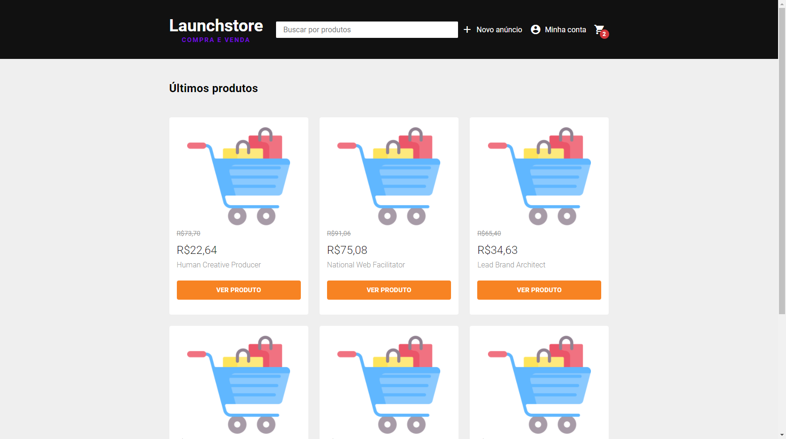
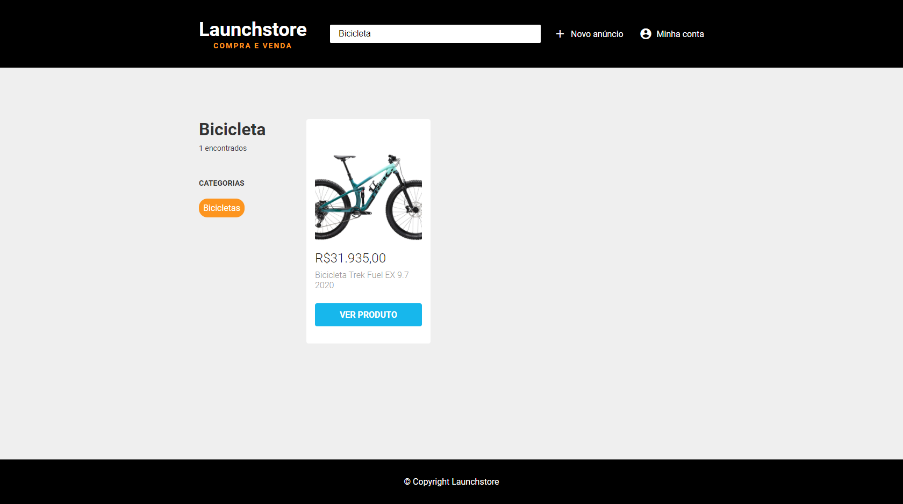
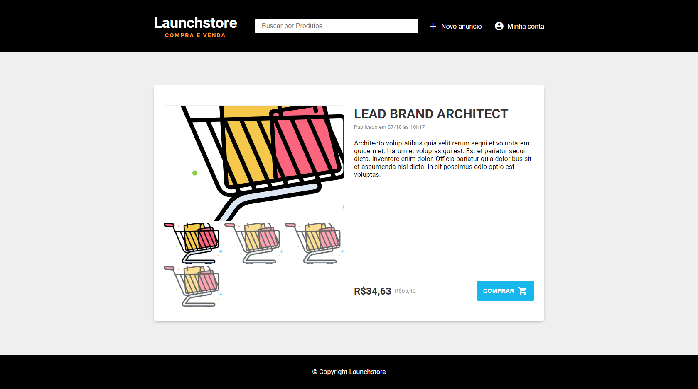

<h1 align ="center">
    
</h1>

> Launchstore is a simple application built with JavaScript and SQL queries 💰


## 📌 Resources 

- 🛒 Buying and selling products.
- 📃 Search by categories.
- 🔍 Product filter.
- 🖼 Upload images.

## 🚀 Technologies used

The following technologies were used

- [x] [JavaScript](https://developer.mozilla.org/pt-BR/docs/Web/JavaScript)
- [x] [Node.js](https://nodejs.org/en/)
- [x] [Nunjucks](https://mozilla.github.io/nunjucks/)
- [x] [PostgreSQL](https://www.postgresql.org/)

### 📜 **Libraries**

- [x] [Browsersync](https://www.browsersync.io/)
- [x] [npm-run-all](https://www.npmjs.com/package/npm-run-all)
- [x] [method-override](https://www.npmjs.com/package/method-override)
- [x] [node-postgres](https://www.npmjs.com/package/pg) 
- [x] [nodemon](https://www.npmjs.com/package/nodemon) 
- [x] [multer](https://www.npmjs.com/package/multer) 
- [x] [bcrypt](https://www.npmjs.com/package/bcrypt)

## 🎨 Layout

**Home**



**Search/Categories**



**Product**



---

## Project installation 👷‍♂️

First you need to have [Node.js](https://nodejs.org/en/) installed, then **run the following command:**

``` bash 
## To clone the project
git clone https://github.com/LeonardoCampello-dev/Foodfy.git
```

``` bash 
## To install the dependencies
npm install
```

``` bash 
## Running project
npm start
```

## 📜 License 

Released in 2020. This project is under the [MIT license](/LICENSE).

## Made with love by Leonardo Campello 💚 
